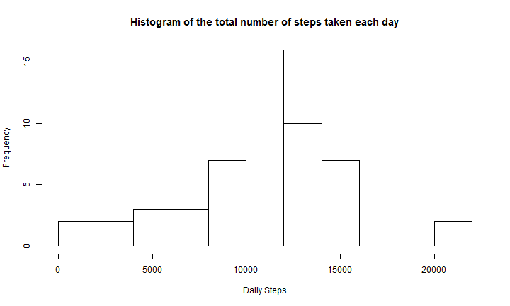
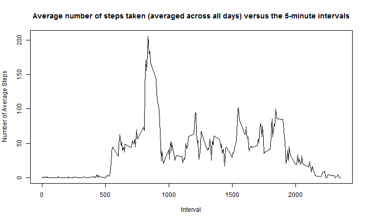
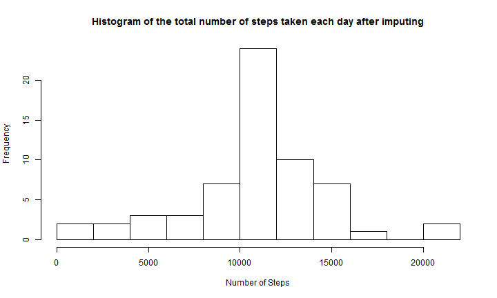
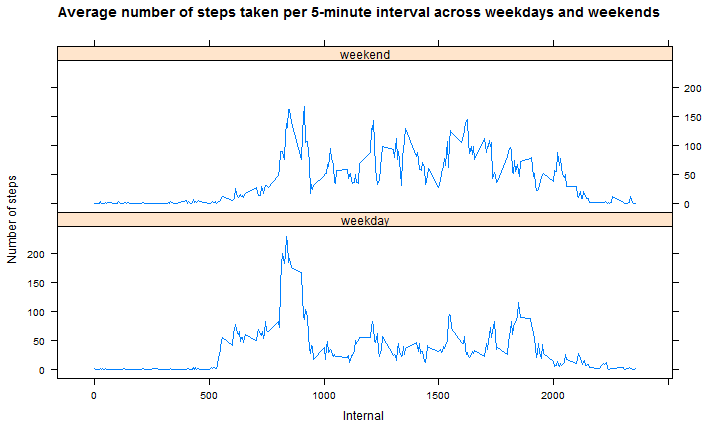

# Reproducible Research: Peer Assessment 1


## Loading and preprocessing the data

```r
work_dir=getwd()
zipfilepath=paste(work_dir, '/activity.zip', sep='')
unzip(zipfilepath, overwrite=TRUE, exdir=work_dir)
filepath=paste(work_dir, '/activity.csv',sep='')
rawdata=read.csv(filepath)
proc1data=na.omit(rawdata)
```

## What is mean total number of steps taken per day?

```r
dailysteps=aggregate(proc1data$steps,by=list(proc1data$date), FUN=sum)
names(dailysteps)=c('date','steps')
hist(dailysteps$steps, breaks=10,xlab='Daily Steps',ylab='Frequency', main='Histogram of the total number of steps taken each day')
```

 

```r
mean_steps_perday=mean(dailysteps$steps, na.rm=TRUE)
median_steps_perday=median(dailysteps$steps, na.rm=TRUE)
result=paste('Mean number of steps taken each day :',mean_steps_perday,sep=' ')
result
```

```
## [1] "Mean number of steps taken each day : 10766.1886792453"
```

```r
result=paste('Median number of steps taken each day :',median_steps_perday,sep=' ')
result
```

```
## [1] "Median number of steps taken each day : 10765"
```


## What is the average daily activity pattern

```r
avgsteps=aggregate(proc1data$steps,by=list(proc1data$interval), FUN=mean)
names(avgsteps)=c('interval','steps')
```

```r
plot(avgsteps,type='l',xlab='Interval',ylab='Number of Average Steps', main='Average number of steps taken (averaged across all days) versus the 5-minute intervals')
```

 

```r
maxstepminute=avgsteps$interval[avgsteps$steps==max(avgsteps$steps)]
maxinterval=maxstepminute/5
result=paste('The ',maxinterval,'th 5-minute interval (',maxstepminute,') on average contains the maximum average steps.', sep='') 
result
```

```
## [1] "The 167th 5-minute interval (835) on average contains the maximum average steps."
```

## Imputing missing values

```r
num_missimgvalues=nrow(rawdata)-nrow(proc1data)
result=paste('The total number of rows with missing data is',num_missimgvalues,sep=' ')
result
```

```
## [1] "The total number of rows with missing data is 2304"
```
Strategy for imputing missing data: the mean for the corresponding 5-minute interval is used to fill in the missing steps data.


```r
proc2data=rawdata
len=nrow(proc2data)
for (i in 1:len) {
  if (is.na(proc2data$steps[i])) {
    proc2data$steps[i]=avgsteps$steps[avgsteps$interval==proc2data$interval[i]]
  }
}

newdailysteps=aggregate(proc2data$steps,by=list(proc2data$date), FUN=sum)
names(newdailysteps)=c('date','steps')
hist(newdailysteps$steps, breaks=10,xlab='Number of Steps',ylab='Frequency', main='Histogram of the total number of steps taken each day after imputing')
```

 

```r
new_mean_steps_perday=mean(newdailysteps$steps)
new_median_steps_perday=median(newdailysteps$steps)
new_mean_steps_perday
```

```
## [1] 10766
```

```r
new_median_steps_perday
```

```
## [1] 10766
```

```r
difference_mean=mean_steps_perday - new_mean_steps_perday
difference_median=median_steps_perday - new_median_steps_perday
result=paste('Difference bewteen mean daily steps before imputing and after imputing:', difference_mean, sep=' ')
result
```

```
## [1] "Difference bewteen mean daily steps before imputing and after imputing: 0"
```

```r
result=paste('Difference bewteen median daily steps before imputing and after imputing:', difference_median, sep=' ')
result
```

```
## [1] "Difference bewteen median daily steps before imputing and after imputing: -1.1886792452824"
```

I uses the mean for the corresponding 5-minute interval to fill in the missing steps data. As can be seen, there is no difference in mean daily steps, there is very small difference in median daily steps between imput data and un-imput data. From the histogram, it can be seen that imputing missing data increases the estimates of the total daily number of steps.

## Are there differences in activity patterns between weekdays and weekends?

```r
daysind=rep(0,nrow(proc2data))
dayofweek=weekdays(as.Date(proc2data$date))
daysind[dayofweek=='Sunday' | dayofweek=='Saturday']=1
proc2data$weekend=factor(daysind, labels=c('weekday','weekend'))
```

```r
newavgsteps=aggregate(proc2data$steps,by=list(proc2data$interval,proc2data$weekend), FUN=mean)
names(newavgsteps)=c('interval','weekend','steps')
library(lattice)
xyplot(steps~interval | weekend, data=newavgsteps,layout=c(1,2), type='l', xlab='Internal',ylab='Number of steps', main='Average number of steps taken per 5-minute interval across weekdays and weekends')
```

 

